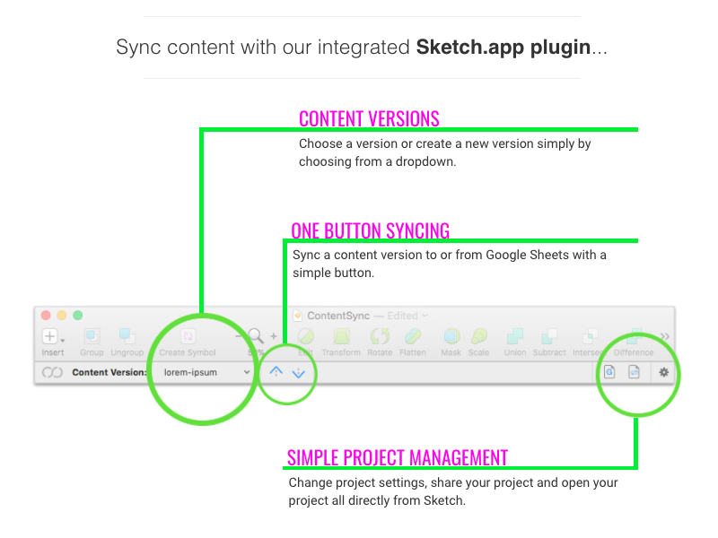
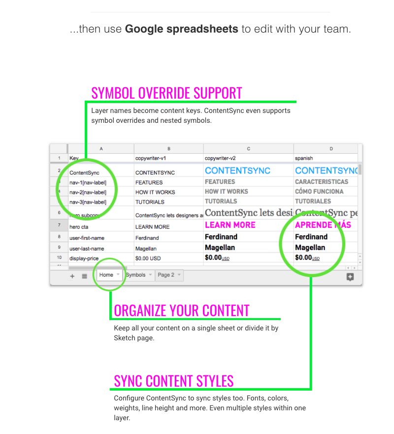

Abstract, version, and translate your Sketch.app design content.

Check out our new **[ContentSync Desktop App](https://github.com/contentsync/contentsync-desktop)** too!

# SketchContentSync 4.2

Sync to Google Documents and more. **Directly from within Sketch.**

Visit [www.contentsync.io](http://www.contentsync.io) for more details.

### ContentSync Platform

We require an account to allow ContentSync to integrate with your Google Documents and more. Don't worry, we only require access to documents we create so all your other documents remain secure and private.

Register for free at [www.contentsync.io](http://www.contentsync.io/) and get started easily.

### SketchContentSync Plugin

#### Install with Sketch Runner
With Sketch Runner, just go to the `install` command and search for `SketchContentSync`. Runner allows you to manage plugins and do much more to speed up your workflow in Sketch. [Download Runner here](http://www.sketchrunner.com).

#### Install Manually
+ [Download plugin here](https://s3-us-west-2.amazonaws.com/contentsync-sketch-releases/SketchContentSync-latest-stable.zip)
+ Open zip file
+ Double click on the .sketchplugin file.

## Support / Bugs / Feature Requests

Create a github issue or contact [support@contentsync.io](mailto:support@contentsync.io).
