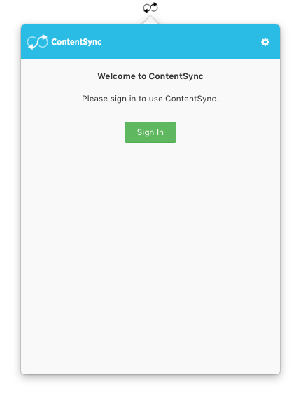
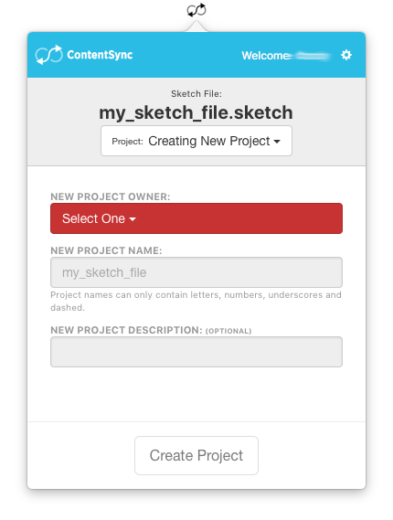
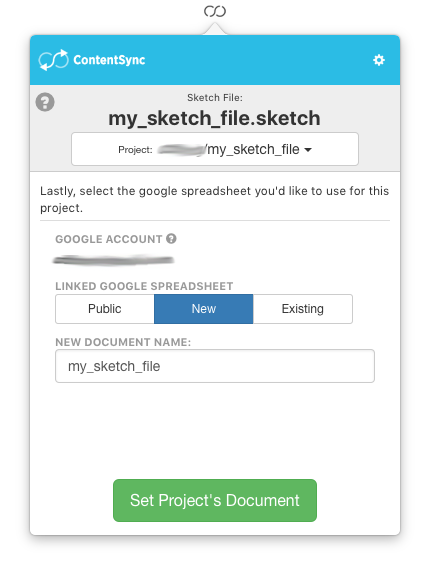
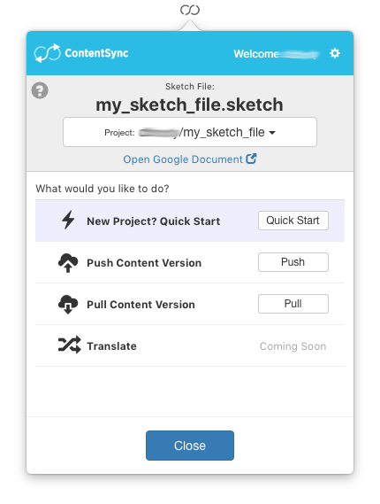
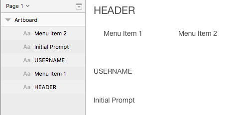
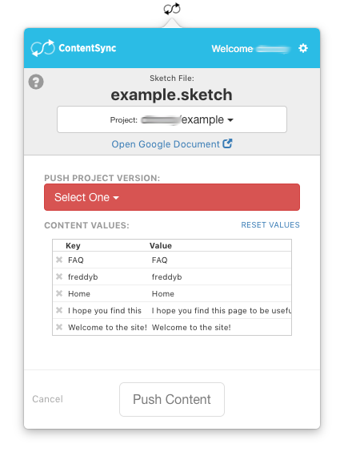
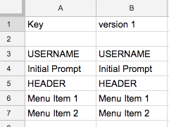
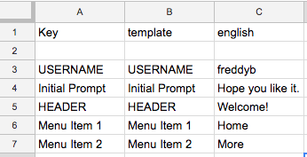
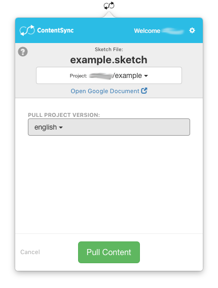
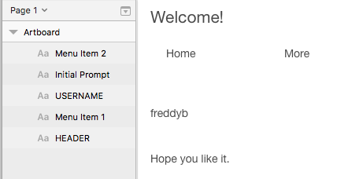

# SketchContentSync

ContentSync Sketch Plugin.

Abstract, version, and translate your Sketch.app design content. Sync to Google Documents and more.

## Downloading & ContentSync Platform

Register for free at [www.contentsync.io](http://contentsync.io/) and get started easily.

Download plugin [here](./packaged/SketchContentSync.zip). Open zip file and double click on the .sketchplugin file.

# Overview

## Pull Data From Google Spreadsheets into Sketch.app

## Push Data From Sketch.app into Google Spreadsheets

# Interface Flow

SketchContentSync works by integrating this plugin with the ContentSync.app.

### ContentSync.app

### Create Projects

### Link To Google Document

### Main Project Menu

## Pushing Data

Pushing data allows you to create a new version of data in your spreadsheet. This will _**write**_ to your google document.

Takes a regular Sketch design...

Prompts which fields to push and which version to push to...

You can push to a new version or overwrite an existing one.

## Pulling Data

Pulling data allows you to update you Sketch design from your Google spreadsheet. This will _**write**_ to your sketch file.

### Take version from your spreadsheet:

### Prompts which version to pull from...

### Updates your sketch file...

# Support / Bugs / Feature Requests

Please submit an issue or contact [support@contentsync.io](mailto:support@contentsync.io).

# Roadmap

+ Support each Sketch.app design page as a separate Spreadsheet Sheet
+ Support advanced text styling per layer (various fonts, sizes, weights, etc)
+ Support image previews of contextual content
+ Better support of nested symbols
+ Improved naming scheme for additional use cases
+ Support one click design translation
