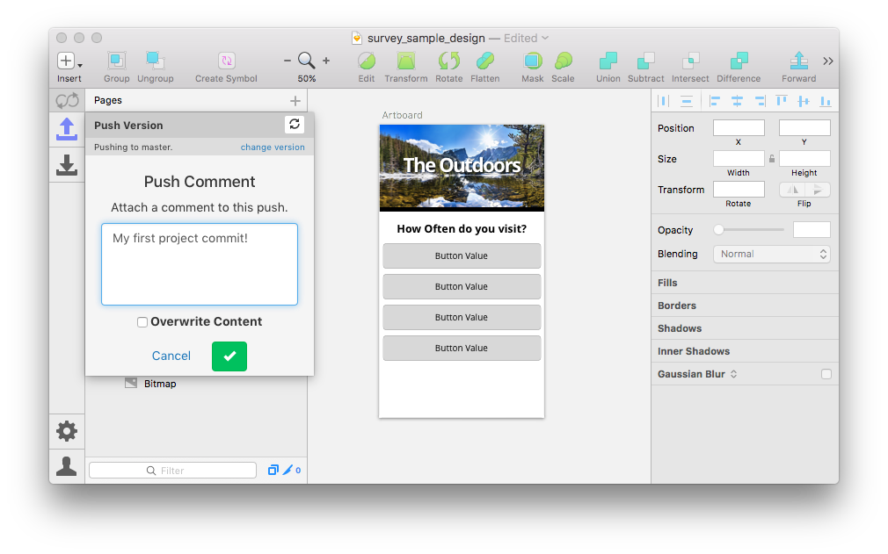
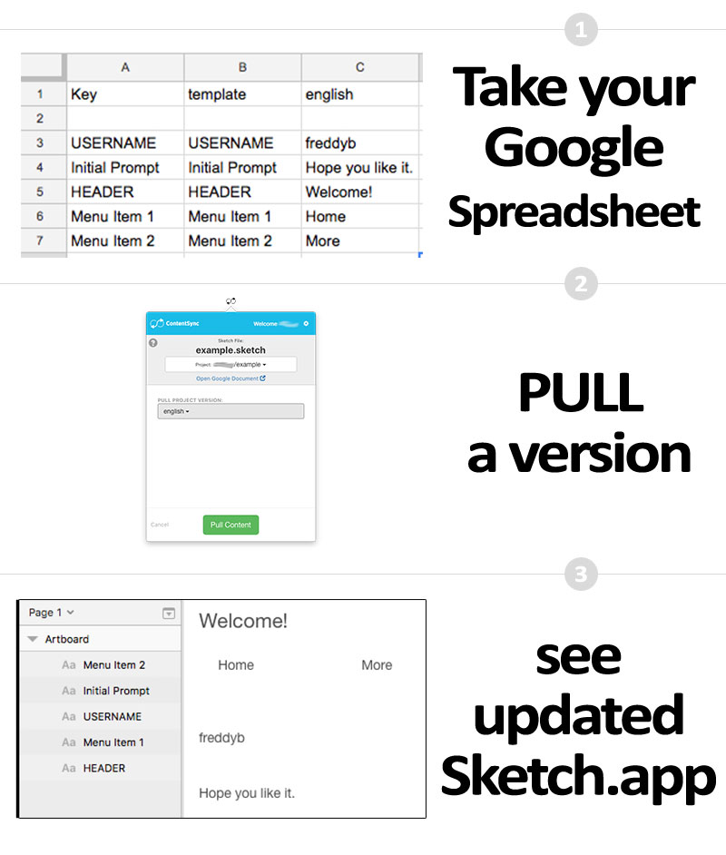
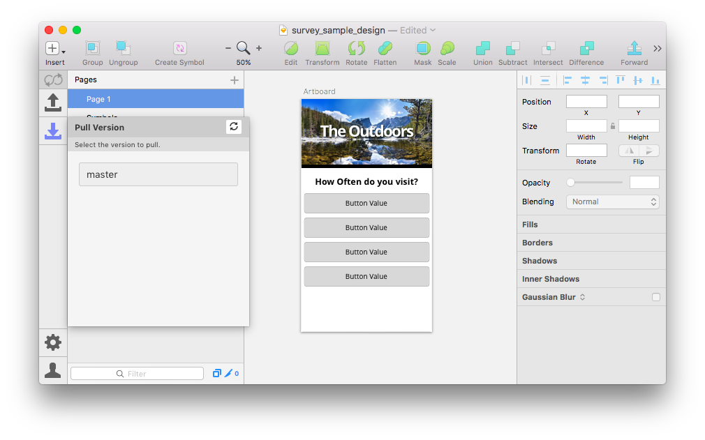

Abstract, version, and translate your Sketch.app design content.

# SketchContentSync 3.1.0

Sync to Google Documents and more. **Directly from within Sketch.**

# ContentSync Platform

We require an account to allow ContentSync to integrate with your Google Documents and more. Don't worry, we only require access to documents we create so all your other documents remain secure and private.

Register for free at [www.contentsync.io](http://contentsync.io/) and get started easily.

# SketchContentSync Plugin

## Install with Sketch Runner
With Sketch Runner, just go to the `install` command and search for `SketchContentSync`. Runner allows you to manage plugins and do much more to speed up your workflow in Sketch. [Download Runner here](http://www.sketchrunner.com).

## Install with Sketchpacks
** Coming Soon **

## Install Manually
+ [Download plugin here](https://s3-us-west-2.amazonaws.com/contentsync-sketch-releases/SketchContentSync-latest-stable.zip)
+ Open zip file
+ Double click on the .sketchplugin file.

# Overview

## Pull Data From Google Spreadsheets into Sketch.app

## Push Data From Sketch.app into Google Spreadsheets

# Interface Flow

SketchContentSync plugin integrates directly within Sketch:

## Pushing Content

## Pulling Content

# Support / Bugs / Feature Requests

Please submit an issue or contact [support@contentsync.io](mailto:support@contentsync.io).

# Roadmap

- [x] Support each Sketch.app design page as a separate Spreadsheet Sheet
- [x] Support advanced text styling per layer (various fonts, sizes, weights, etc)
- [x] Better support of nested symbols
- [ ] Support image previews of contextual content
- [ ] Improved naming scheme for additional use cases
- [ ] Support one click design translation
