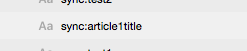
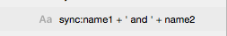
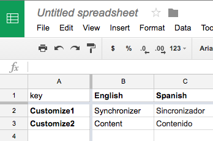
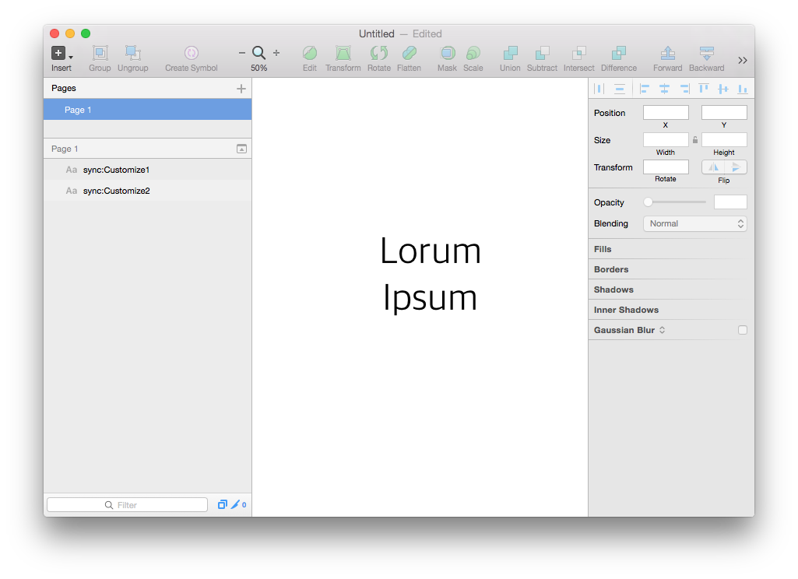
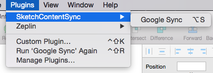
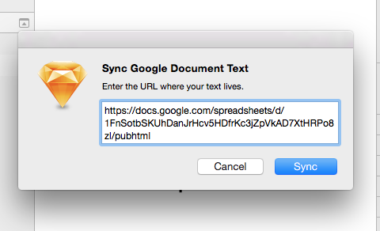
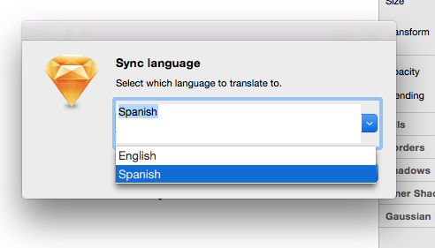
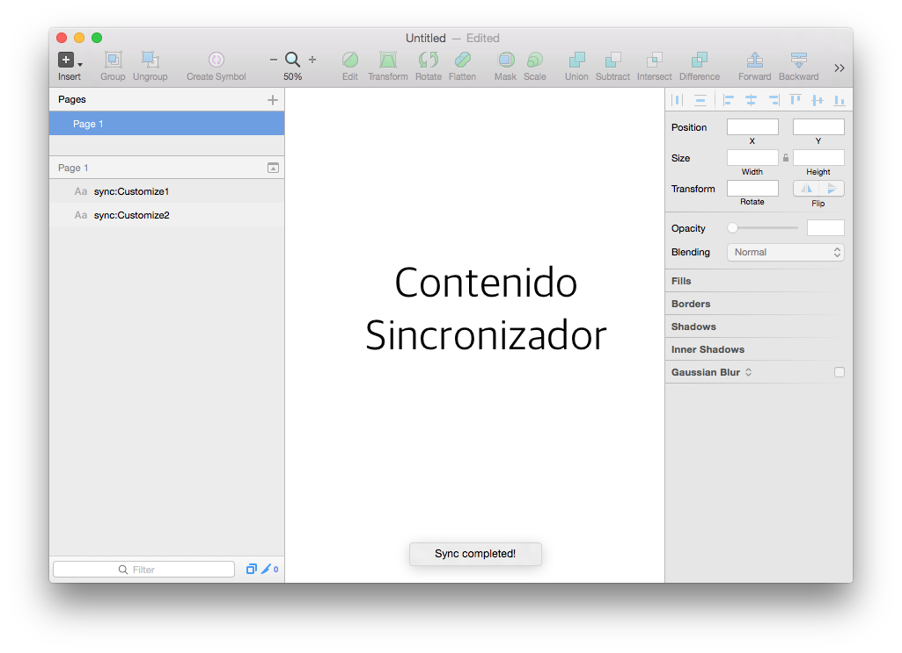

# Sketch Content Sync

Dynamically update content within sketch files.

Currently support:

+ [Google Spreadsheets](https://docs.google.com)
+ [Sheetsu](https://sheetsu.com)

# Features

### Content Synchronizing

Naming any text element with the format `sync:<key>` will synchronize its content. The content will be from the spreadsheet row where the first cell's content matches `<key>`.

### Content Localizing

Each row may have many columns. Before each sync you may select which column to populate content from. This supports having different versions or localizations of your content.

### Content Concatenating

A synchronized element's content can also be based on concatenating multiple `<key>`'s or constants. For example, you may use `sync:<key1> + <key2>` to generate content which is `<key1 value><key2 value>`. Furthermore you may concatente strings as well using `sync:<key1> + ' and ' + <key2>` which will result in the content `<key1 value> and <key2 value>`.

To add new lines between items, use `'\n'` for example `sync:<key1> + '\n' + <key2>`.

# How to Install It

+ Download the Zip File
+ Double click on the .sketchplugin file
+ Available in Sketch under `Plugins` > `SketchContentSync`

# Quick Example

+ Download and open [this sketch file](./examples/simpleexample.sketch)
+ Run **SketchContentSync > Google Sync** under the **Plugins** menu
+ **Sync Google Document Text** Popup
  + Paste this URL in the URL popup: `https://docs.google.com/spreadsheets/d/1xkkFbXdCEC2Rr_rxO74jdZ30SZSxBuzLdNPFlhsjPws/`
  + Press `Sync`
+ **Sync Content Version** Popup
  + Use default and press `Sync`
+ Voila! The content in the Sketch should have updated.
+ Notice there are some spelling errors in the synced content. Try syncing again with another version or even another language.

[You can see the sample spreadsheet used for this example here.](https://docs.google.com/spreadsheets/d/1xkkFbXdCEC2Rr_rxO74jdZ30SZSxBuzLdNPFlhsjPws/edit?usp=sharing)

# How to use it

## 1. Create Google Document

Create a google document with the content you want to use. The first column is the `[key]` of the content, and each column to the right is a translation / varition of that content.

## 2. Create text field(s)

Naming a text field with a name as `sync:[key]`, replacing `[key]` with the key used in the google document will cause it to be synchronized. Other text fields will be ignored.

## 3. Run ContentSync Sketch Plugin

### 3.1 Run Plugin

### 3.2 Enter Google Doc URL

The URL must be public. To get the Google Document URL use either:

+ Share doc via `File` > `Publish to the web...`
+ Use https://sheetsu.com

### 3.3 Choose Language / Variation

The language/variation is each of the columns in the google document.

### 3.4 Voila!

## References

This was created using concepts from:

+ http://developer.sketchapp.com/
+ https://github.com/rodi01/RenameIt
+ https://github.com/nolastan/sync.sketchplugin
