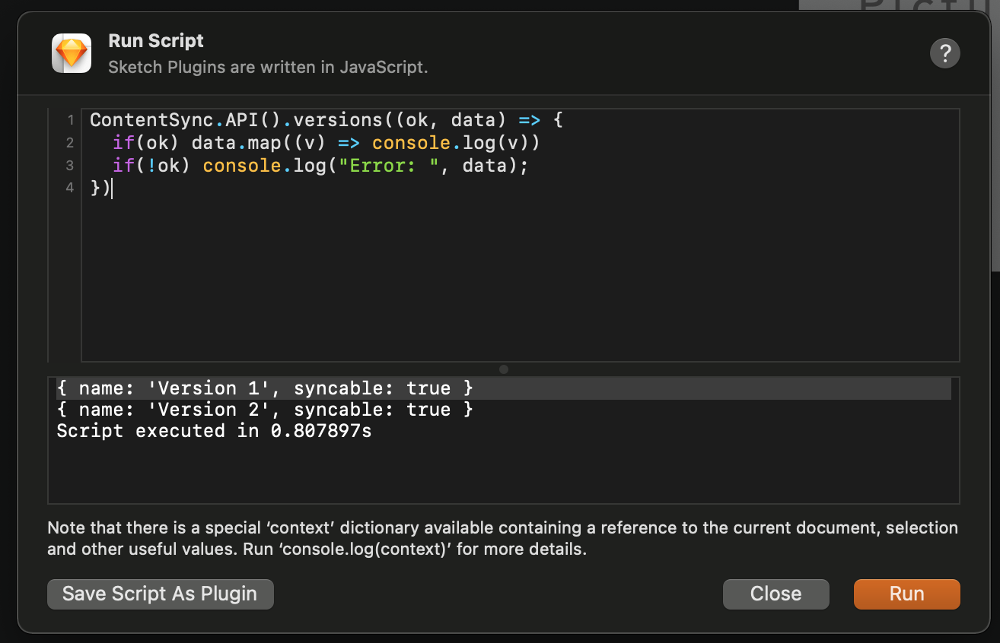

**Content collaboration for Sketch. Sync copy between Sketch designs and Google Spreadsheets and Microsoft 365 Exel.**

# SketchContentSync 8.4.x ALPHA

Sync content to Google Spreadsheets and Microsoft 365 Excel directly from within Sketch.

Visit [www.contentsync.com](http://www.contentsync.com) for more details.

### Version Your Sketch Designs


### Manage Content within Google Spreadsheets


### Build Directly into Sketch


### ContentSync Platform

We require an account to allow ContentSync to integrate with your Google Documents and more. **We only require access to documents we create so all your other documents remain secure and private.**

Register for free at [www.contentsync.com](http://www.contentsync.com/) and get started easily.

## SketchContentSync Plugin

#### Install with DMG

- [Download plugin here](https://contentsync-plugins.s3.amazonaws.com/sketch/ContentSync_Sketch_latest_stable.dmg)
- Open DMG file
- Double click on the SketchContentSync.sketchplugin file.
  

#### Install with Sketch Runner

With Sketch Runner, just go to the `install` command and search for `SketchContentSync`. Runner allows you to manage plugins and do much more to speed up your workflow in Sketch. [Download Runner here](http://www.sketchrunner.com).


#### ContentSync Scripting Support

You can also use ContentSync within you Sketch scripts as of 8.3.0. The ContentSync API is accessed using `ContentSync.API()`.

For example:

```javascript
// This example will print all Content Versions of the currently selected ContentSync project.
ContentSync.API().versions((ok, data) => {
  if (ok) data.map((v) => console.log(v));
  if (!ok) console.log("Error: ", data);
});
```

The shape of each version is:

```json
{
  "name": "Version 1",
  "syncable": true
}
```



## Support / Bugs / Feature Requests

Create a github issue or contact [support@contentsync.com](mailto:support@contentsync.com).

### Changelog

#### 8.4.1-alpha

- Fixes bug causing hanging when searching for a symbol name that doesnt exist
- Fixes searching libraries to ignore disabled libraries
- Improves push pipeline to handler larger syncs, work in the background, and show progress

#### 8.4.0-alpha

- Fixes parsing symbols instances with remote symbol masters (even is library isnt found)
- Improves pull pipeline to handle larger syncs, work in background, and show progress

#### 8.3.1

- Fixes some cases where crashes occur during push/pull

#### 8.3.0

- Add [ContentSync scripting API](#ContentSync-Scripting-Support).

#### 8.2.0

- Upgrade to universal binary for Apple Silicon Support

#### 8.1.1

- Fixes bug when using vector editing

#### 8.1.0

- Support Sketch 72

#### 8.0.0

- Support Sketch 71

#### 7.0.1

- Fixes UI / crashing issue on some older MacOS versions

#### 7.0.0

- Support Sketch 70

#### 6.5.5

- UI Improvements - Better responsiveness and improves performance when CS Layer Inspector is closed
- UI Bug Fix - Symbol Type key properly uses context name
- Symbol Swapping Improvements - Improves order changes are applied to ensure overrides are applied on new symbols
- Removes text layer auto height in favor of using Sketch Smart Layout feature

#### 6.5.4

- New Feature: Using "No Symbol" on a symbol override will set the override to no symbol - helpful for smart layouts. Works on push and pull.
- Bug Fix: Symbol overrides now update after symbol type override is changed too

#### 6.5.2

- Bug Fix: Fixes Sketch UI layer selection would sometimes hang
- New Feature: Allows for default key prefix / suffix

#### 6.5.1

- Bug Fix: Refreshes sidebar after push to make sure panels are up to date
- Improvement: Only caches content key settings on overrides when content key on override is explicitly set.

#### 6.5.0

- Improvement: Supports **[Smart Layout](https://www.sketch.com/docs/symbols/smart-layout/)** when syncing symbol overrides.
- Improvement: New DMG package install **supports OSX Catalina** security protocols.
- Improvement: Moves API from contentsync.io to contentsync.com
- Improvement: **Default Key Prefix** - New project setting to prepend keys with Page Name, Artboard Name or both.
- Improvement: **Default Key Suffix** - New project setting to append object id for uniqueness across layers.

#### 6.4.0

- New Feature: Supports Microsoft 365 Excel syncing
- Improvement: Syncing artboards uploads one at a time for better messaging
- Improvement: Improved error reporting on failed syncs
- Improvement: Keys used for images wont override spreadsheet key values on push
- Bug Fix: Fixes crashing in Sketch 55.1
- Bug Fix: Shows ContentSync icon on image layer icons

#### 6.3.1

- Bug Fix: Fixes issue when pulling in Sketch 55.

#### 6.3.0

- Adds basic support for syncing image overrides and bitmap layers
- Adds additional settings for better default controls
- Fixes some bugs which would cause crashing

#### 6.2.0

- Adds additional project settings for default settings and formats
- Change symbol type overrides to always be value of referenced symbols. Not blank for default value.

#### 6.1.1

- Fixes issue when pushing full design on large files

#### 6.1.0

- Updates UI to improve usability
- Fixes bug when pulling updates on nested symbols of the same type
- Fixes bug when updating settings when multiple layers are selected
- Allows for selecting default sheet

#### 6

- Supports Sketch 53
- New ContentSync UI - Inspector panels and better layer list integration
- Easier to customize - Inspector panel give you full control
- Supports symbol swapping - set symbol type key and change symbol types dynamically
- Supports content fitting - automatically resize symbols to fit content override values
- Much more! Check out our [full docs](https://www.contentsync.com/docs)

#### 5.1

- Updates UI to match Sketch 52
- Adds keyboard shortcut for disabling & enabling ContentSync on layers

#### 5

- Supports Sketch 52

#### 4.2.13

- Fix override parsing bug that would result in [NSInvalidArgumentException: NSDictionaryM isNull] errors.

#### 4.2.12

- Fixes toggling ContentSync toolbar
- Removes 'Add Context' setting - use mapping functions instead

#### 4.2.11

- Updates build for better formatting and automatic version recogition
- Fix layer/symbol position and sizing for Desktop (and soon to come new platform)
- Fix isNull bug when syncing with styles enabled
- Fix to ensure project settings are updated before commands are run
- Improved error reporting and displaying

#### 4.2.5

- Fixes issues when pushing library symbols
- Fixes positioning and sizing of text layers on exported artboards for ContentSync Desktop
- Fixes ignoring hidden layers for artboart exporting for ContentSync Desktop
- Ignored artboards with no text layers for ContentSync Desktop

#### 4.2.4

- [#79](https://github.com/contentsync/SketchContentSync/issues/79) Fixes manifest version for updates

#### 4.2.3

- [#77](https://github.com/contentsync/SketchContentSync/issues/77) Fixes version dropdown updates when versions removed
- [#76](https://github.com/contentsync/SketchContentSync/issues/76) Supports Sketch Midnight theming
- Improves speed of push

#### 4.2.2

- Automatically pushes all keys for overrides - even blank ones
- Fixes version dropdown / selection when creating a new version
- [#74](https://github.com/contentsync/SketchContentSync/issues/74) Fixes handling of cases of MSImmutableTextLayer
- Better error capturing/reporting for support help

#### 4.2.1

- Fixes positioning of embedded layers in groups for ContentSync Desktop
- Fixes issues syncing when symbol instance has image override
