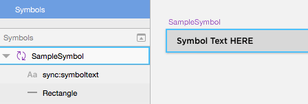
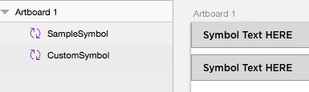
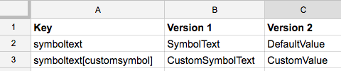
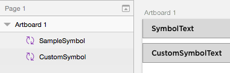

[<< Back](./../README.md)

# Symbol Overrides

As of version 3.1, SketchContentSync supports overriding content per symbol instance. This feature makes use of Sketch's symbol override feature.

## Usage

Naming a text element `sync:<key>` within a Symbol definition allows for the symbol's content to be synchronized.

By default, the text field will be overwritten using the standard `sync` method. However, the used symbol instance may be renamed to customize the content for each usage of the symbol. By renaming a symbol instance to `<symbolname>`, you can then use the content key `<key>[<symbolname>]` within the spreadsheet to set the content for the text within that specific symbol instance.

## Example

**1. Within a symbol, set a text field to sync:**

**2. To customize content for different instances of a symbol, rename the symbol instance layer:**

**3. Define content for symbol (and optionally customized overrides):**

**4. After syncing, symbols get respective values:**

